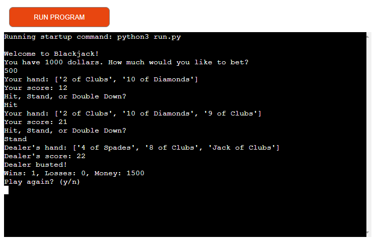
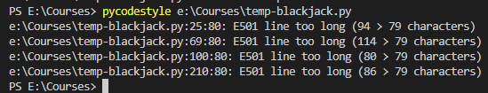

# Blackjack

Blackjack is a Python terminal program running a game of blackjack via the node js template from code institute.

Blackjack is an implementation of the game of Blackjack, a popular casino card game. The player plays against the dealer and the goal is to have a hand value closer to 21 than the dealer without going over.

The Blackjack app allows the user to:
- Place bets and play a game of Blackjack against a dealer.
- Choose from different actions during their turn, such as hitting, standing, or doubling down.
- Try to beat the dealer by getting a hand value closer to 21 without going over.
- Experience the excitement and suspense of a classic casino game from the comfort of their own device.

[Here is the live version of the project](https://project-3-blackjack.onrender.com)

 

## How it works 

- The game starts by initializing a new instance of the Game class.
- The player is asked to input a bet amount, and the deck is shuffled.
- Two cards are dealt to the player and two cards are dealt to the dealer.
- The player is asked to choose whether to hit, stand, or double down.
- If the player chooses to hit, another card is dealt to the player and their score is updated.
- If the player chooses to double down, their bet amount is doubled and another card is dealt to the player.
- If the player chooses to stand, their turn ends.
- If the player's score goes over 21, they bust and the game ends.
- If the player chooses to stand, the dealer takes their turn and hits until their score is at least 17.
- If the dealer's score goes over 21, they bust and the player wins.
- If the player's score is higher than the dealer's score, the player wins.
- If the dealer's score is higher than the player's score, the dealer wins.
- If the scores are tied, the bet is returned to the player.
- The player's wins, losses, and money are updated.
- The player is asked if they want to play again.
- If the player chooses to play again, the game starts over.
- If the player chooses to quit, the game ends.

## Features
- User can place bets on each hand
- User can choose to hit, stand, or double down
- Dealer automatically hits until their hand value is at least 17
- Game ends when the user runs out of money or chooses to quit

- Future Features
    - Splitting: Allow players to split their hand into two separate hands when they are dealt a pair.
    - Insurance: Allow players to place an insurance bet if the dealer's face-up card is an Ace, which can protect their original bet if the dealer has a Blackjack.
    - Surrender: Allow players to forfeit their hand and receive half of their original bet back.
    - Card counting: Add the ability for advanced players to count cards and adjust their betting strategy based on the remaining cards in the deck.
    - More betting options: Add additional betting options, such as side bets or progressive jackpots, to make the game more exciting and increase the potential payout for the player.
 
## Planning

- I planned out the game with a text based mockup, iterating on it as I fleshed out the features required:
    - Start
    - While player has money and chooses to play again:
    - Shuffle deck
    - Ask player for bet amount
    - Deal two cards to player and two cards to dealer
    - While player has not busted or stood:
        - Display player's hand and score
        - Ask player if they want to hit, stand, or double down
        - If player chooses to hit:
        - Deal another card to player
        - If player has busted:
            - End player's turn
        - If player chooses to double down:
        - Deal another card to player
        - Double player's bet amount
        - End player's turn
        - If player chooses to stand:
        - End player's turn
    - If player has busted:
        - Display "You busted" message
        - Update player's losses
    - Else:
        - While dealer's hand value is less than 17:
        - Dealer hits (deals another card to dealer)
        - If dealer has busted:
        - Display "Dealer busted" message
        - Update player's wins
        - Else:
        - Compare player's hand value to dealer's hand value
        - If player has higher hand value:
            - Display "You win" message
            - Update player's wins and money
        - Else if dealer has higher hand value:
            - Display "Dealer wins" message
            - Update player's losses
        - Else:
            - Display "It's a tie" message
            - Return player's bet amount
    - Display updated wins, losses, and money
    - Ask player if they want to play again
    - End

## Testing

Manually tested the project with the following:

- Test in a local version in vscode, in github and on render for deployment
- Used a linter (pycodestyle / formerly PEP8) and verfified the code has no problems other than some lines being slightly over 80 characters
- Entered invlaid input at each step to confirm no input bugs

Pycodestyle output:

 

## Deployment

- The project was deployed using Code Institute's mock terminal for Heroku.

    - Steps for deployment
        - Create a new render account
        - Make sure the config vars for PORT are setup with process.env.PORT
        - Setup a new web service on render, 
        - Link the render app to the repository
        - For Build Command enter yarn as the value
        - For the Start Command enter node index.js as the value, as then entry file is index.js
        - Click Create Web Service and access the live deploy link

## References

- Code Institute love sandwiches project and videos
- Blackjack Python Project: https://github.com/sheetalbongale/Blackjack-Python
- Object-Oriented Programming in Python: https://www.codecademy.com/learn/python-for-programmers/modules/object-oriented-programming-in-python/cheatsheet
